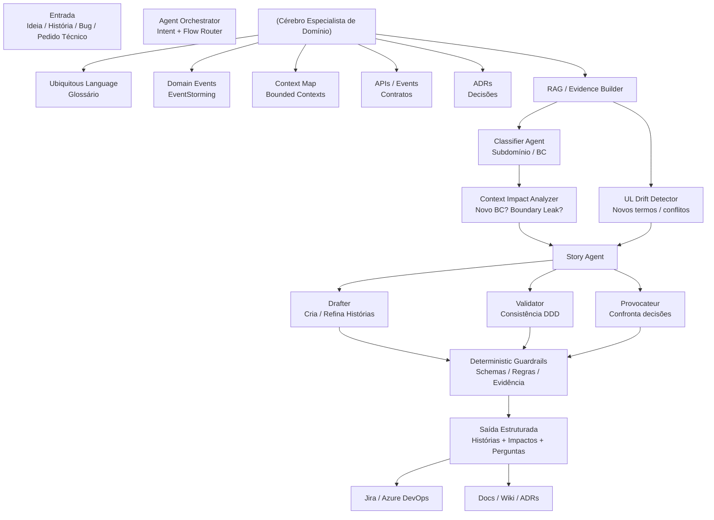
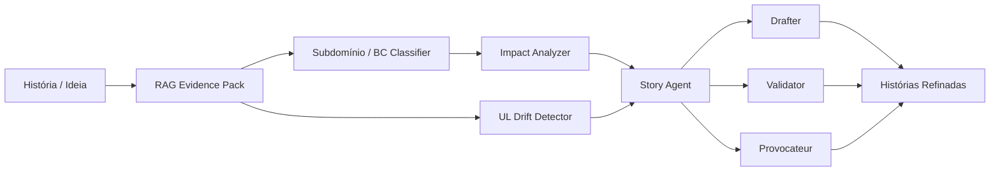

Sim — é **totalmente possível** e faz muito sentido começar com um **desenho único de “visão do todo”** antes de detalhar cada agente.\
Abaixo eu te entrego **um desenho inicial em Mermaid**, já alinhado com tudo que discutimos:

* “cérebro especialista de domínio” (artefatos DDD + RAG)
* agente de histórias (Drafter / Validator / Provocateur)
* classificação de subdomínio / bounded context
* checagem de linguagem ubíqua
* confrontação de decisões
* guardrails determinísticos

Esse diagrama é **intencionalmente macro**, para você conseguir “enxergar o sistema respirando”.

***

## 1) Visão geral — Arquitetura agêntica (alto nível)

***

## 2) Como “ler” esse diagrama (pontos importantes)

### 🔹 O cérebro NÃO é um agente

Ele é um **repositório vivo de verdade do domínio** (artefatos DDD).\
Os agentes **não “sabem” o domínio** — eles **consultam** o cérebro via RAG.

> Isso é o que evita “histórias criativas, porém erradas”.

***

### 🔹 Classificação ≠ Modelagem

Note que:

* **Classifier Agent** só classifica (subdomínio / BC)
* **Impact Analyzer** só avalia limites e consequências
* **Story Agent** só escreve e questiona histórias

👉 Isso segue um princípio essencial para IA confiável:

> **não misturar tarefa de classificação com tarefa de decisão/modelagem**

***

### 🔹 Story Agent não é “um prompt”

Ele é um **container de papéis**:

* **Drafter** → gera material concreto
* **Validator** → checa alinhamento com DDD
* **Provocateur** → desafia decisões e suposições

Esse trio reduz drasticamente:

* overconfidence da IA
* “aceitação silenciosa” de más decisões
* drift arquitetural

***

### 🔹 Guardrails são cidadãos de primeira classe

O fluxo **sempre passa** por guardrails determinísticos:

* schemas
* regras de nomenclatura
* verificação de evidência
* contratos

> A IA propõe.\
> O sistema **impede** besteira.

***

## 3) Versão alternativa — foco só no “Story Agent” (zoom)

Se você quiser uma visão **mais focada só no agente de histórias**, use este segundo diagrama:

***

## 4) Próximo passo natural (quando você quiser evoluir)

Sem perguntar nada agora (só te orientando):

Os próximos refinamentos típicos são:

1. **Um diagrama Mermaid por agente**, detalhando inputs/outputs
2. **Estados da história** (draft → challenged → approved)
3. **Onde entra aprovação humana**
4. **Quais decisões viram ADR automaticamente**
5. **Quais métricas de qualidade você mede** (ex.: UL drift, BC leaks)

Quando você quiser, o próximo passo lógico é:

> **desenhar o “Story Agent” como um bounded context próprio**, com contrato claro para Jira/ADO.

Se quiser, no próximo turno eu posso:

* detalhar **o contrato de saída** desse agente (JSON/YAML)
* ou desenhar **o Context Map completo** incluindo “AI Components” como BCs

Você escolhe o próximo corte.
