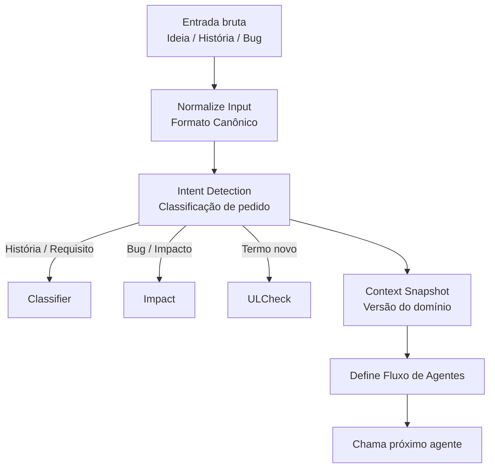
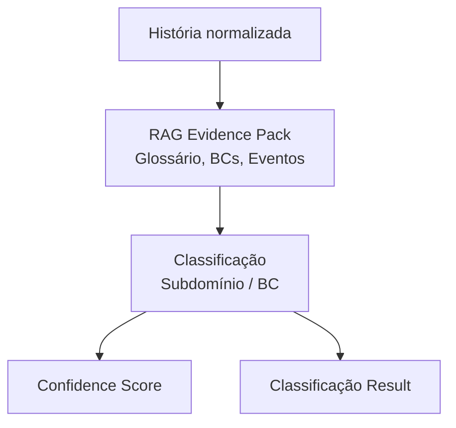
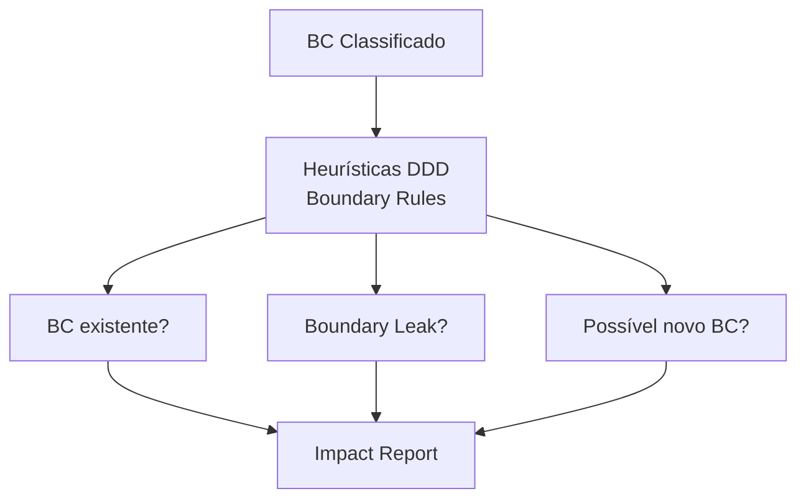
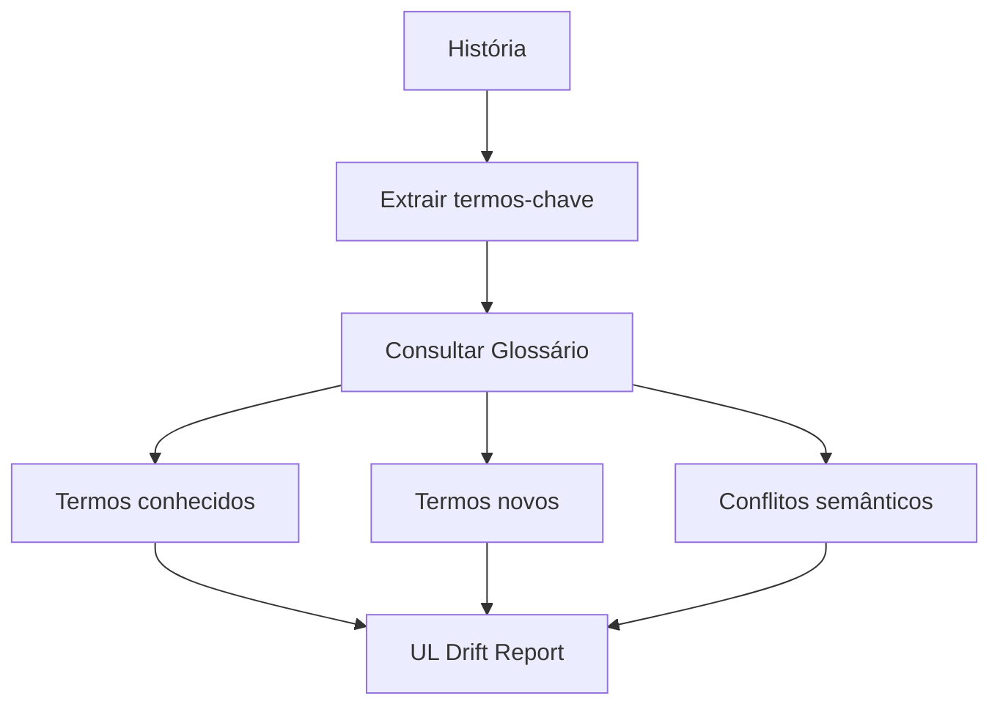
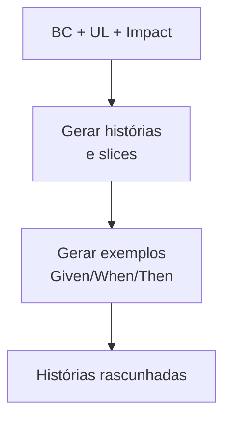
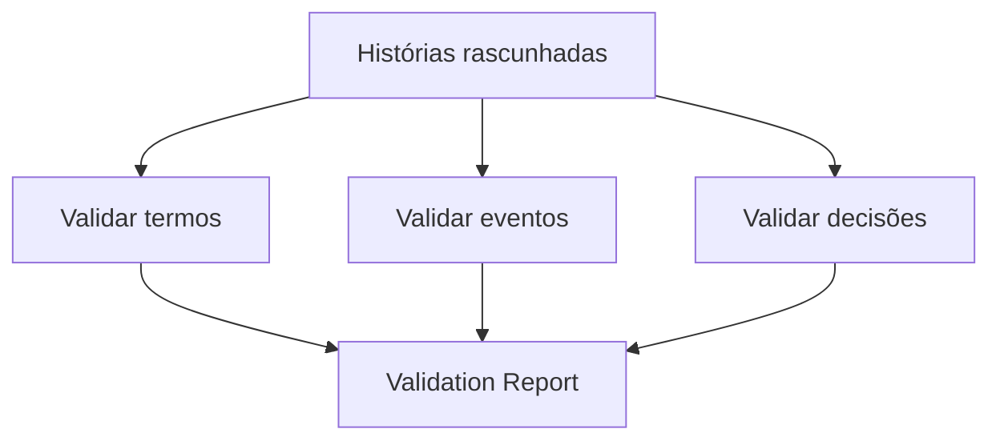
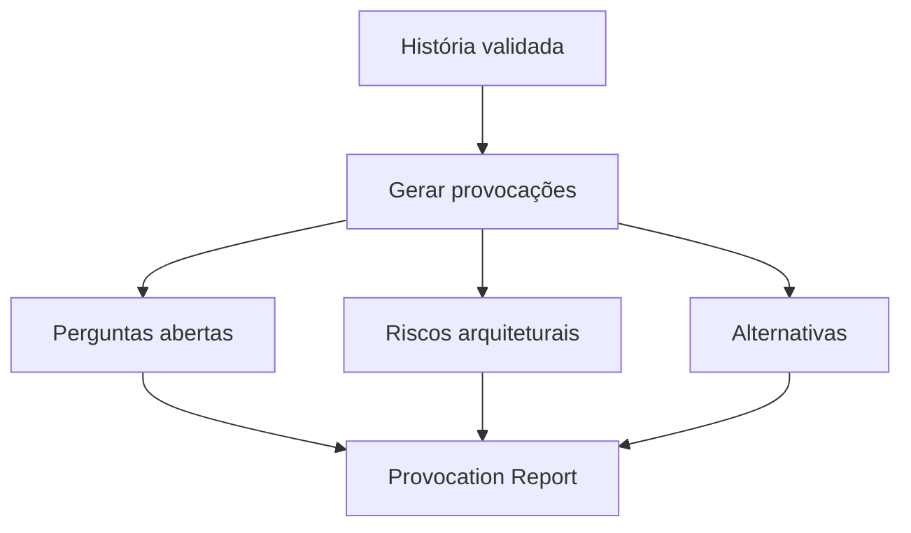
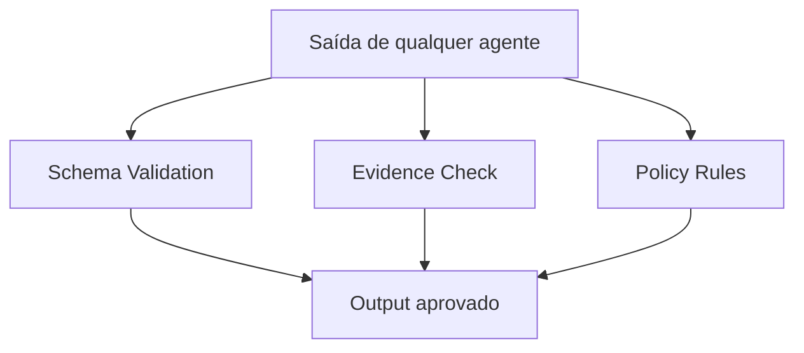

Perfeito. Abaixo está **um diagrama Mermaid por agente**, **todos no mesmo nível de detalhamento**, sempre mostrando:

* **Inputs explícitos**
* **Processamento interno (responsabilidade do agente)**
* **Outputs estruturados**
* **Onde entram guardrails / evidências**

Os diagramas estão pensados para você **colar direto no Mermaid Live / Markdown** e também para **bater com DDD + agentic architecture** (sem “mágica”).

***

# 1️⃣ Agent Orchestrator (roteador do fluxo)

👉 Responsável por **entender a intenção** e **chamar os agentes certos na ordem certa**.



**Inputs**

* Texto livre
* Metadata (origem, produto, time)

**Outputs**

* Fluxo definido
* Context snapshot (versão do domínio usada)

***

# 2️⃣ Subdomain & Bounded Context Classifier Agent

👉 **Só classifica. Não decide design.**



**Inputs**

* História normalizada
* Evidence pack (RAG)

**Outputs**

```yaml
classification:
  subdomain: Payments
  bounded_context: Billing
  confidence: 0.82
  evidence:
    - glossary: Invoice
    - event: InvoiceIssued
```

***

# 3️⃣ Context Impact Analyzer Agent

👉 Avalia **limites**, **colisões** e **sinais de novo BC**.



**Inputs**

* Classificação
* Context Map atual

**Outputs**

```yaml
impact:
  touches_other_contexts: true
  other_contexts: [Shipping]
  new_bc_candidate: false
  recommendation: "Definir relação Customer/Supplier"
```

***

# 4️⃣ Ubiquitous Language Drift Detector Agent

👉 Guarda **consistência semântica** do domínio.



**Inputs**

* História
* Glossário versionado

**Outputs**

```yaml
ubiquitous_language:
  new_terms:
    - name: Chargeback
      suggested_definition: "Contestação de pagamento"
  conflicts:
    - term: Order
      contexts: [Sales, Shipping]
```

***

# 5️⃣ Story Drafter Agent

👉 **Cria material concreto** para o time trabalhar.



**Inputs**

* BC definido
* Linguagem válida
* Impact report

**Outputs**

```yaml
stories:
  - title: Cancelar fatura
    as_a: Cliente
    i_want: cancelar uma fatura
    so_that: evitar cobrança indevida
    rules:
      - Só antes do vencimento
```

***

# 6️⃣ Story Validator Agent

👉 Garante que a história **não contradiz o domínio existente**.



**Inputs**

* Histórias rascunhadas
* Glossário, eventos, ADRs

**Outputs**

```yaml
validation:
  status: warning
  issues:
    - type: event_conflict
      detail: Evento InvoiceCancelled não existe
```

***

# 7️⃣ Story Provocateur Agent

👉 **Confronta decisões**, não propõe solução “bonita”.



**Inputs**

* História validada
* Impact + UL drift

**Outputs**

```yaml
provocations:
  - question: "Isso cria dependência forte com Shipping?"
  - risk: "Cancelamento síncrono pode quebrar SLA"
  - alternative: "Usar evento InvoiceCancellationRequested"
```

***

# 8️⃣ Deterministic Guardrails (transversal)

👉 **Não é um agente cognitivo**, é infraestrutura de segurança.



***

## ✅ O que você ganha com esse desenho

* Cada agente tem **uma responsabilidade clara**
* Dá para **implementar incrementalmente**
* Dá para **testar agente por agente**
* Dá para tratar agentes como **bounded contexts**
* Reduz drasticamente hallucination e drift arquitetural

***

## Próximo passo natural (sem perguntar agora)

O próximo nível de maturidade é:

* **Context Map completo dos agentes como BCs**
* **Contratos formais entre agentes (JSON Schema)**
* **Estados da história (Draft → Challenged → Approved)**

Quando quiser, posso:

* desenhar o **Context Map Mermaid**
* ou definir os **schemas de input/output reais**
* ou mostrar como isso encaixa em **Jira / Azure DevOps**

Esse desenho já é **nível arquitetura de referência**.
