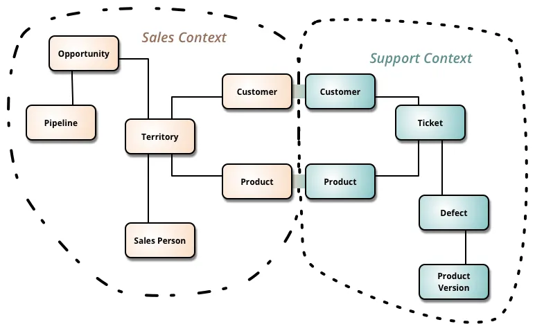

# Mapeando seus Contextos
Separando responsabilidades no nível do domínio

---

## O que são Contextos Delimitados (Bounded Context) em um tweet?

_Contexto Delimitado não é sobre código.
É sobre onde um significado começa e termina.
Se o significado muda, o contexto mudou._

--- 

## Contextos Delimitados

Contextos delimitados servem para dar coerência à entidades que podem estar presentes em mais de 1 contexto delimitado, e consequentemente por estarem presentes em contextos distintos, essas entidades poderiam ter responsabilidades distintas e significados distintos por contexto.

---

**Um limite explícito onde**
- Um modelo de domínio específico é válido
- Linguagem ubíqua é consistente

**Cada Contexto Delimitado**
- Tem seu próprio modelo
- Pode ter sua própria arquitetura
- Evolui de forma independente

---

> Se você precisa explicar “o que isso significa aqui”, você cruzou um Bounded Context.
DDD só torna esse limite explícito.

---

---

**💡 Dicas**
- Uma boa forma de identificarmos limites dos Contextos Delimitados será a sua linguagem ubíqua. (Exemplo: Lead)
- Enquanto Subdomínios nascem a partir do negócio, os Contextos Delimitados são criados.

---

> Como diz [Ruth Malan](https://2025.dddeurope.com/speakers/ruth-malan/), o design de arquitetura é inerente sobre limites.

---

## Por que mapear Contextos Delimitados?
- Sistemas reais raramente vivem em um único Contexto Delimitado
- Organizações crescem → múltiplos times, múltiplos modelos
- Integração mal projetada gera:
    - Alto acoplamento
    - Efeitos colaterais imprevisíveis
    - Dificuldade de evolução independente

---

## O problema da integração mal planejada

Sintomas comuns de má integração
- Compartilhamento de banco de dados
- Reuso de entidades de outro contexto
- APIs genéricas e anêmicas
- Dependência temporal forte entre sistemas

Causa raiz
- Falta de clareza sobre:
- Quem depende de quem
- Quem dita o modelo
- Qual o nível de autonomia esperado

---

> Integração é uma decisão estratégica de arquitetura, não apenas técnica.

---

# Mapeamento de Contextos Delimitados (Context Map)
Os Mapas de Contexto descrevem o contato entre contextos limitados e equipes com uma coleção de padrões. Eles ajudam a entender como os diferentes contextos interagem e colaboram.

---

Existem nove padrões de mapas de contexto e três relacionamentos de equipe diferentes. Os padrões do mapa de contexto descrevem uma variedade de perspectivas, como fornecimento de serviços, propagação de modelos ou aspectos de governança. Essa diversidade de perspectivas permite obter uma visão geral holística das relações de equipe e de contexto delimitado.

---

---

## Relacionamentos de Equipe
- Cooperação
- Cliente-Fornecedor
- Caminhos Separados

---

## Cooperação

 

Equipes trabalham juntas para alcançar um objetivo comum. Elas compartilham responsabilidades e colaboram estreitamente.

---

## Cliente-Fornecedor

 

Uma equipe (cliente) depende de outra equipe (fornecedor) para fornecer um serviço ou funcionalidade específica. A equipe fornecedora deve atender às necessidades e expectativas da equipe cliente.

---

## Caminhos Separados

 

As equipes trabalham de forma independente, com pouca ou nenhuma interação. Cada equipe é responsável por seu próprio contexto delimitado e não depende das outras equipes.

---

# Padrões de Mapeamento do tipo Cooperação

---

### Parceria (Partnership)

Características
- Times colaboram de forma próxima
- Decisões são tomadas em conjunto
- Alto nível de alinhamento

Quando usar
- Contextos fortemente acoplados ao negócio
- Times com maturidade semelhante

Riscos
- Perda de autonomia
- Escalabilidade organizacional limitada

---

### Núcleo Compartilhado (Shared Kernel)

Características
- Parte do modelo é compartilhada
- Código e conceito comuns

Quando usar
- Núcleo do domínio verdadeiramente comum
- Forte governança

Riscos
- Mudanças impactam múltiplos contextos
- Evolução mais lenta

---

# Padrões de Mapeamento do tipo Cliente-Fornecedor

---

### Conformista (Conformist)

Características
- Downstream se adapta totalmente ao modelo do Upstream
- Nenhuma influência no modelo fornecedor

Quando usar
- Sistemas legados
- Fornecedores externos

Trade-off
- Simplicidade vs. perda de expressividade do domínio

---

### Camada Anticorrupcao (ACL - Anticorruption Layer)

Características
- Camada de tradução entre modelos
- Protege o domínio interno

Benefícios
- Preserva a linguagem ubíqua
- Reduz acoplamento

Exemplos técnicos
- Adapters
- Facades
---

### Servico de Host Aberto (Open Host Service)

Características
- Upstream expõe um modelo bem definido
- Interface pensada para múltiplos consumidores

Benefícios
- Reduz customizações específicas
- Facilita escalabilidade de integrações
- Promove consistência

---

### Publicador-Assinante (Published Language)

Características
- Linguagem comum para comunicação
- Formato padronizado (ex: JSON, XML)

Benefícios
- Facilita integração entre múltiplos contextos
- Reduz ambiguidades na comunicação

---

# Padrões de Mapeamento do tipo Caminhos Separados

---

### Separação Total (Separate Ways)
Características
- Contextos evoluem independentemente
- Nenhuma integração direta

Quando usar
- Contextos completamente distintos
- Baixa necessidade de compartilhamento de dados

Riscos
- Duplicação de dados
- Inconsistências entre contextos

---

### A grande bola de lama
Um sistema (parte de um) que é uma bagunça por ter modelos mistos e limites inconsistentes.

Big Ball Of Mud é uma demarcação de um modelo ou qualidade de sistema ruim. **Você quer ter certeza de que essa bagunça não se propague para outros contextos limitados.**

---

## Conclusão
- Mapear Contextos Delimitados é crucial para arquiteturas complexas
- Escolher padrões de integração adequados melhora a colaboração entre equipes
- Entender relacionamentos de equipe ajuda a definir responsabilidades claras
- Um bom Context Map é uma ferramenta viva que deve evoluir com o sistema