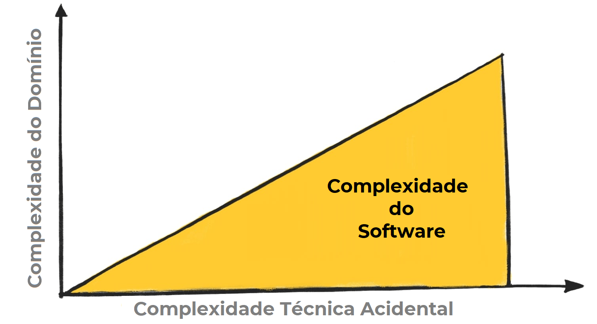
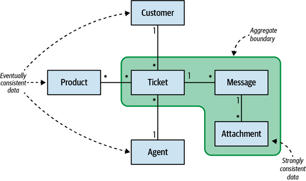
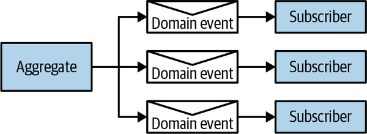
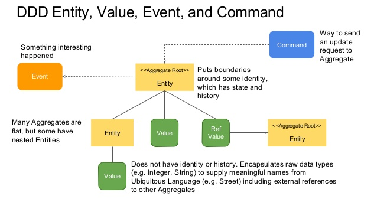
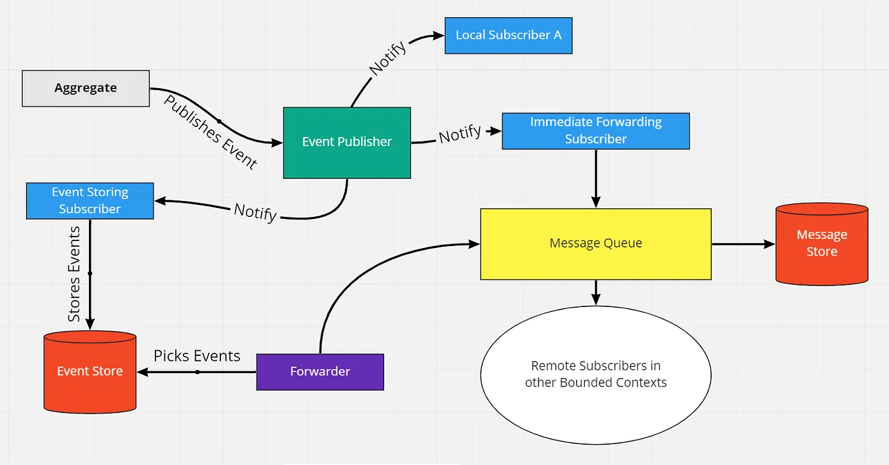
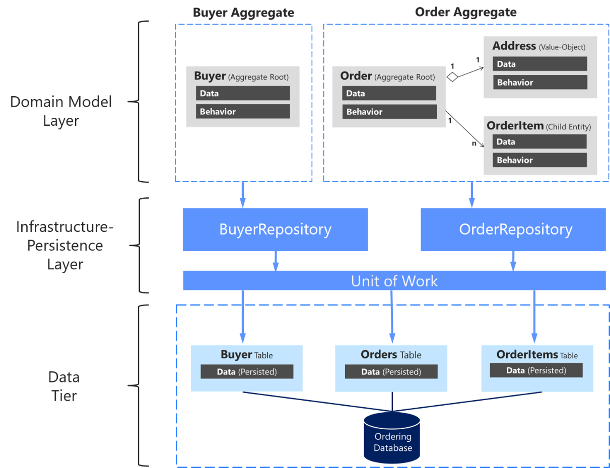

# Mapeando seus Modelos de Domínio
### Transformando Domínios em Software de Valor

---

## O que Modelagem de Domínio em um tweet?
_"Modelagem de domínio é a arte de criar um modelo de software que reflete a complexidade do negócio, usando uma linguagem onipresente para conectar todos os envolvidos."_

---


---

## Principais Objetivos da Modelagem de Domínio
- Capturar a essência do negócio em um modelo de software.
- Fazer o código falar a linguagem ubíqua do negócio.
- Criar um modelo rico que encapsula regras de negócio e comportamentos.
- Evitar a anêmia de modelo e outros anti-padrões de modelagem.

<br>

_**“Atacando as complexidade no coracao do software.”**_

---


---

## Anti-Patterns Comuns na Modelagem de Domínio

- **Anemia de Modelo**: Modelos que são apenas dados, sem comportamento.
- **Modelos de Tabela**: Modelos que refletem a estrutura do banco de dados, não do negócio.
- **Modelos de Interface**: Modelos que refletem a interface do usuário, não o domínio.

---

Referencias:

[Object Calisthenics - Jeff Bay](https://bolcom.github.io/student-dojo/legacy-code/DevelopersAnonymous-ObjectCalisthenics.pdf)

[Primitive Obsession - Refactoring Guru](https://refactoring.guru/smells/primitive-obsession)

[DDD e Modelagem de Domínio - Object Calisthenics](https://www.youtube.com/watch?v=YGNH71KPIes&list=PLNHxHgB-_LTtnyj453VPF7_CdYM4dpv_Z&index=5)

---

### Exemplo: Modelagem Anêmica em C#

```csharp
public class Pedido
{
  public int Id { get; set; }
  public string NomeCliente { get; set; }
  public decimal Valor { get; set; }
  public DateTime DataCriacao { get; set; }
  public string Status { get; set; }
}

```

---


> ⚠️ **Problema Crítico de Modelagem Anêmica**: Toda lógica de negócio está concentrada no serviço. O modelo `Pedido` é apenas um container passivo de dados, sem responsabilidades ou comportamentos. Isso viola os princípios de DDD e orientação a objetos, tornando o código frágil, difícil de manter e desconectado da realidade do domínio.

---

## Complexidade

O padrao de modelo de dominio serve para lidar com casos de logica de negocio complexa, onde o modelo tem comportamentos e regras de negocio. Ele e mais adequado para sistemas onde a complexidade do dominio e alta e a logica de negocio e central para o sistema.

---



---

**💡 Dica**

> O modelo nao deve ter qualquer preocupacao de infraestrutura ou tecnologia, como por exemplo, detalhes de persistencia, detalhes de comunicacao, detalhes de interface do usuario, etc. O modelo deve ser puro e focado apenas no dominio. <br><br> Use objetos POJO (Plain Old Java Objects) ou POCO (Plain Old CLR Objects) para manter o modelo limpo e livre de dependências de infraestrutura.

---

# Building Blocks da Modelagem de Domínio

- **Entidades**: Objetos com identidade própria e ciclo de vida.
- **Value Objects**: Objetos sem identidade, definidos por seus atributos.
- **Agregados**: Conjuntos de entidades e value objects que formam uma unidade de consistência.
- **Repositórios**: Abstrações para persistência de agregados.
- **Serviços de Domínio**: Operações que não pertencem a nenhuma entidade ou value object específico.

---

## Value Objects

- **Definição**: Objetos que representam conceitos do domínio sem identidade própria, definidos por seus atributos.
- **Exemplo**: Endereço, Dinheiro, Data.
- **Benefícios**: Imutabilidade, facilidade de teste, expressividade.

---

### Exemplo: Value Object com Records em C#

```csharp
public record Email(string valor)
{
  public Email(string valor) : this(valor)
  {
    if (string.IsNullOrWhiteSpace(valor) || !valor.Contains("@"))
      throw new ArgumentException("Email inválido");
  }
}

public record Valor(decimal valor)
{
  public Valor(decimal valor) : this(valor)
  {
    if (valor < 0)
      throw new ArgumentException("Valor não pode ser negativo");
  }
}
```

---

> **Benefício**: O domínio agora é explícito. `Email` e `Valor` carregam suas próprias regras de negócio, não são apenas strings ou decimals.

[PO, POJO, BO, DTO e VO](https://www.devmedia.com.br/diferenca-entre-os-patterns-po-pojo-bo-dto-e-vo/28162)

---

## Entidades

- **Definição**: Objetos que possuem identidade própria e ciclo de vida.
- **Exemplo**: Pedido, Cliente, Produto.
- **Benefícios**: Permitem rastrear mudanças ao longo do tempo, modelar relacionamentos complexos, e encapsular comportamentos relacionados à identidade.

---

## Agregados

- **Definição**: Conjuntos de entidades e value objects que formam uma unidade de consistência.
- **Exemplo**: Um `Pedido` pode ser um agregado que contém `Itens`, `ValorTotal`, e `Status`.
- **Benefícios**: Garantem a consistência do domínio, definem limites claros para transações, e facilitam a modelagem de regras de negócio complexas.

---

**💡 Dicas**

- O agregado representa um limite de consistência. Todas as regras de negócio que garantem a consistência do agregado devem ser implementadas dentro do agregado.
- A consistencia dentro do agregado e forte, mas entre agregados e eventual. Evite criar regras de negócio que dependam da consistência entre agregados diferentes.
- Mantenha os agregados pequenos e focados. Evite criar agregados gigantescos que tentam modelar todo o domínio.

---



---

Referencias:

[Como Escolher o Banco de Dados Correto pra sua Aplicação](https://www.youtube.com/watch?v=bhw4-Kq_RPs)

[Banco de Dados e seus tipos](https://miro.com/app/board/uXjVJCL6b64=/?share_link_id=911501521268)

[Design Data Intensive Applications](https://www.amazon.com.br/Designing-Data-Intensive-Applications-Martin-Kleppmann/dp/1449373321)

---

## Eventos de Domínio

- **Definição**: Representações de algo que aconteceu no domínio, geralmente usado para comunicação entre contextos ou para persistência de histórico.
- **Exemplo**: `PedidoCriado`, `ClienteRegistrado`, `ProdutoAtualizado`.
- **Benefícios**: Permitem modelar mudanças no domínio de forma explícita, facilitam a comunicação entre contextos, e ajudam a manter um histórico de eventos importantes.

---

**💡 Dicas**
- Eventos de domínio devem ser imutáveis e conter apenas os dados necessários para descrever o evento.
- Use eventos de domínio para comunicar mudanças importantes no domínio para outros agregados, contextos ou sistemas.
- *Use filas para comunicacao inter-agregados, use brokers de mensagens para comunicacao inter-contextos, e use logs de eventos para persistencia de historico.

---



---



---



---

Referencias:

[Eventos de domínio: design e implementação](https://learn.microsoft.com/pt-br/dotnet/architecture/microservices/microservice-ddd-cqrs-patterns/domain-events-design-implementation)

---

## Serviços de Domínio

- **Definição**: Operações **sem estado** que não pertencem a nenhuma entidade ou value object específico, mas que ainda fazem parte do domínio.
- **Exemplo**: `CalculadoraDeFrete`, `ProcessadorDePagamento`, `ValidadorDeDesconto`.
- **Benefícios**: Permitem modelar operações complexas que não se encaixam naturalmente em uma entidade ou value object, mantendo o modelo de domínio limpo e focado, frequentemente orquestrando múltiplos Aggregates

---

## Repositórios

- **Definição**: Abstrações para persistência de agregados, permitindo que o modelo de domínio permaneça independente da infraestrutura.
- **Exemplo**: `IPedidoRepository` com métodos como `Salvar(Pedido pedido)` e `ObterPorId(int id)`.
- **Benefícios**: Isolam o modelo de domínio da camada de persistência, facilitando testes e manutenção.

---

**💡 Dicas**
- Defina um repositorio para cada agregado raiz. O repositorio deve ser responsavel apenas por persistir o agregado raiz e seus objetos relacionados, e nao por persistir entidades ou value objects que nao fazem parte do agregado.
- Use interfaces para definir os repositorios, e implemente-os usando a tecnologia de persistencia que melhor se adequa ao seu projeto, como por exemplo, Entity Framework, Dapper, MongoDB, etc.
- Evite expor detalhes de implementação do repositório para o modelo de domínio. O modelo de domínio deve ser completamente independente da camada de persistência.

---



---

Referencias:

[O padrão de repositório](https://learn.microsoft.com/pt-br/dotnet/architecture/microservices/microservice-ddd-cqrs-patterns/infrastructure-persistence-layer-design)