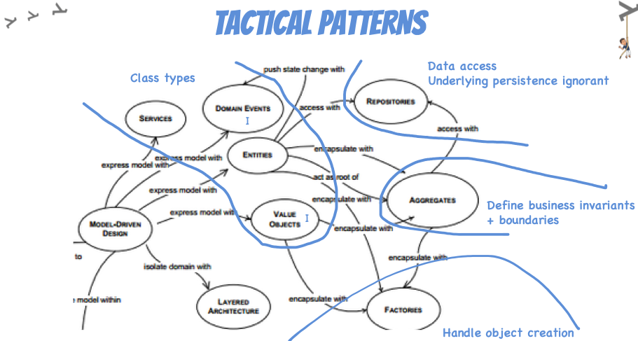

# Mapeando seus Modelos de Domínio
### Transformando Domínios em Software de Valor

---

## O que Modelagem de Domínio em um tweet?
_"Modelagem de domínio é a arte de criar um modelo de software que reflete a complexidade do negócio, usando uma linguagem onipresente para conectar todos os envolvidos."_

---

---

## Principais Objetivos da Modelagem de Domínio
- Capturar a essência do negócio em um modelo de software.
- Fazer o código falar a linguagem ubíqua do negócio.
- Facilitar a comunicação entre técnicos e não técnicos.

 

_**“Atacando as complexidade no coracao do software.”**_

---

