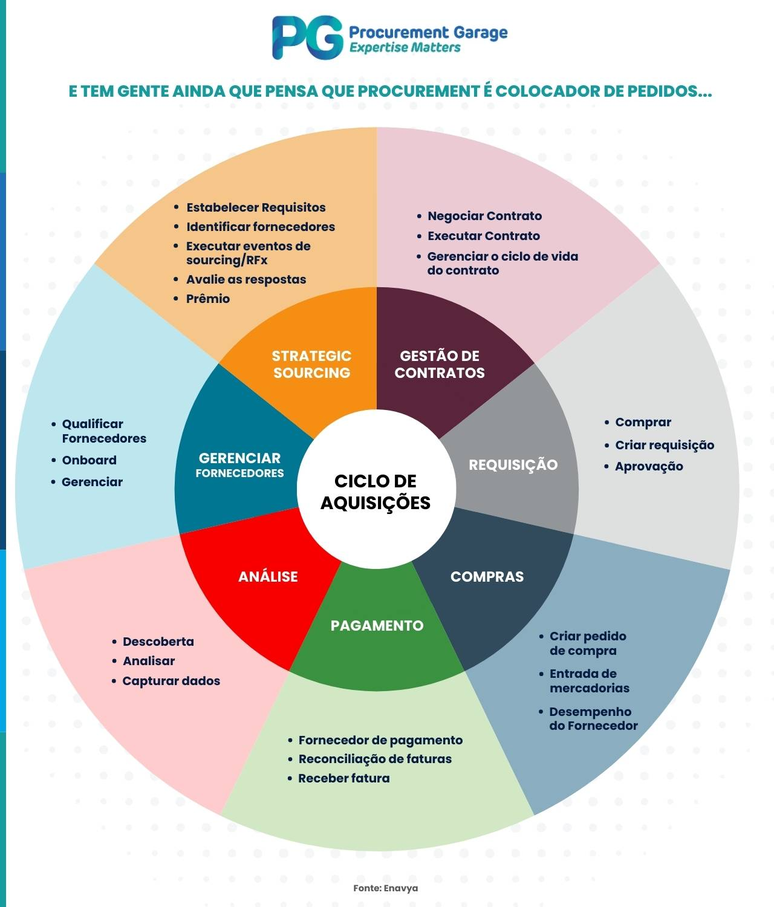
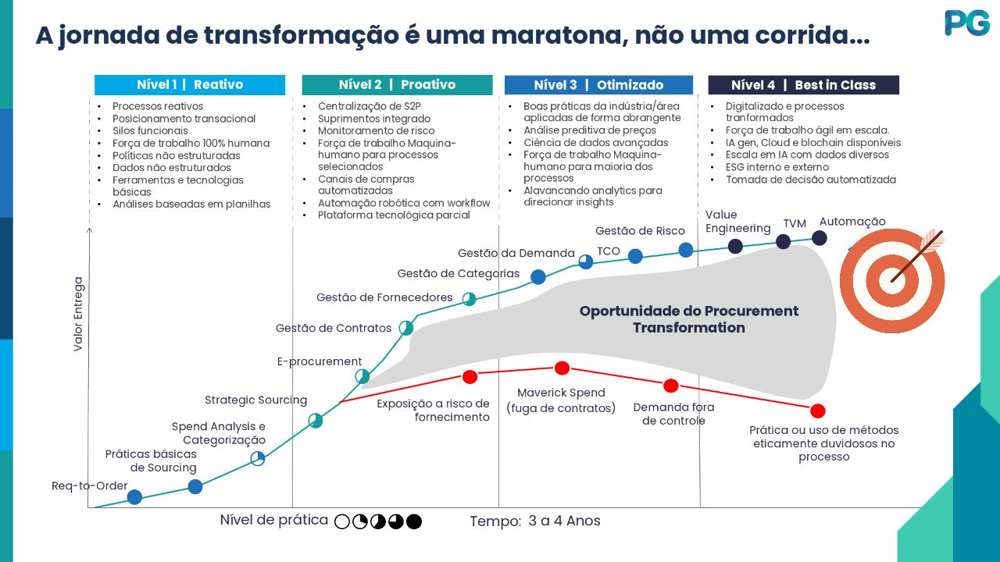

# O que e a area de Procurement
Procurement é um conjunto de atividades estratégicas, implementadas no setor de compras, que têm por objetivo gerar mais eficiência e menos riscos ao processo de aquisição de bens e/ou serviços necessários para a continuidade do fluxo de trabalho de uma companhia.

De forma prática, significa que um processo de procurement contempla diversas etapas que vão desde o levantamento dos itens, produtos e serviços que a empresa está precisando, passando pela pesquisa de mercado e cotação de preços, e chegando até o fechamento do contrato com o fornecedor.

Ou seja, são várias ações pensadas, definidas e aplicadas de forma estratégica, as quais permitem um monitoramento e acompanhamento mais preciso de tudo o que envolve a gestão da cadeia de abastecimento do negócio.

É o que alinha o departamento de compras com outros setores, fortalecendo as relações da empresa com sua rede de fornecedores e parceiros

## Responsabilidades da area de Procurement
A área de Procurement é responsável por garantir que a empresa tenha acesso aos produtos e serviços necessários para o seu funcionamento, ao mesmo tempo em que busca otimizar os custos e minimizar os riscos associados às compras.

Portanto, o setor  é o responsável por diversas tarefas, por exemplo:

- Identificação das necessidades da empresa, no que se refere à sua cadeia de suprimentos;
- Busca por bons fornecedores;
- Negociação com os fornecedores escolhidos;
- Pesquisa de preços e de itens de qualidade;
- Elaboração e acompanhamento de cronogramas de reposição de itens;
- Gestão de contratos;
- Avaliação de desempenho dos fornecedores.

## Para que serve a area de Procurement e sua importancia para as empresas
A área de Procurement é fundamental para garantir que a empresa tenha acesso aos produtos e serviços necessários para o seu funcionamento, ao mesmo tempo em que busca otimizar os custos e minimizar os riscos associados às compras.

Para termos ideia do tamanho e da importância da área, aqui estão alguns dos principais "grandes números" (big numbers) que movimentam o mercado de Procurement hoje:

*   **Controle financeiro:** Em muitas organizações, o procurement chega a controlar de 40% a 80% de todos os custos da empresa. Na indústria, o gasto com fornecedores externos pode representar de 50% a 70% de toda a receita, negociar e comprar de forma eficiente aumenta diretamente a margem de lucro do negócio.
*   **Tamanho do mercado:** Apenas o mercado global de softwares dedicados a compras foi avaliado em US$ 7,5 bilhões em 2024, com previsão de saltar para impressionantes US$ 17,8 bilhões até 2034. 
*   **Serviços terceirizados (PaaS):** O mercado de terceirização de compras (empresas que fazem o procurement para outras) também é gigante: foi avaliado em US$ 6,87 bilhões em 2024 e deve passar dos US$ 16 bilhões até 2033.
*   **Impacto da Inteligência Artificial:** A adoção de IA e agentes autônomos na área tem a expectativa de aumentar a eficiência das equipes em mais de 30%, além de gerar uma economia direta de 5% a 10% nos gastos.
*   **Crescimento executivo:** A área se tornou tão estratégica que o número de líderes de compras (CPOs) que se reportam diretamente ao presidente ou CEO da empresa dobrou, chegando a 33% em 2026.

Além de economizar dinheiro, o procurement é fundamental para:
* **Garantir a operação:** Evita que a empresa fique sem os materiais e serviços necessários para funcionar, prevenindo a paralisação das atividades.
* **Garantir a qualidade:** Assegura que os insumos adquiridos tenham o padrão necessário para não prejudicar o produto final. 
* **Reduzir riscos e desperdícios:** Protege a empresa contra problemas com fornecedores, atrasos, fraudes e desperdício de tempo e recursos. 

> Em resumo, o procurement deixou de ser apenas um setor que "gasta dinheiro" para se tornar um pilar estratégico que protege e gera valor para a companhia.

## Quais as vantagens e os benefícios de procurement?
A área de Procurement traz diversos benefícios para as empresas, como:

- Processos otimizados, mais eficientes e realizados com mais agilidade;
- Redução dos gastos relacionados à cadeia de suprimentos;
- Aprimoramento do relacionamento com os fornecedores;
- Realização de negociações mais vantajosas para a companhia;
- Aumento da qualidade dos itens e serviços adquiridos;
- Crescimento do nível de satisfação dos clientes;
- Elevação do poder competitivo da empresa;
- Aumento da capacidade de o negócio se adequar a diferentes cenários;
- Crescimento do potencial para tomar decisões mais precisas;
- Mitigação dos riscos característicos da contratação de fornecedores.

## Principais desafios do Procurement
A área de Procurement enfrenta diversos desafios, que podem variar dependendo do setor, do porte da empresa e do contexto econômico. No entanto, alguns dos desafios mais comuns incluem:

- Dificuldade de encontrar fornecedores qualificados e confiáveis;
- Complexidade na gestão de contratos e no acompanhamento do desempenho dos fornecedores;
- Riscos de compliance e fraudes, especialmente em processos de compras mais complexos;
- Pressão por redução de custos e aumento de eficiência, o que pode levar a decisões de compra que não consideram o valor total ou os riscos envolvidos.

No dia a dia, os profissionais de procurement enfrentam desafios que exigem bastante jogo de cintura e planejamento. Os principais são:

* **Trabalho manual e burocracia:** Gastar muito tempo com tarefas repetitivas e falta de automação nos processos.
* **Falhas de comunicação e alinhamento:** Lidar com pedidos urgentes ou desalinhados vindos de outras áreas da empresa, além de dificuldades na comunicação com os próprios fornecedores.
* **Atrasos e imprevistos:** Gerenciar fornecedores que não entregam no prazo ou lidar com a escassez repentina de suprimentos no mercado.
* **Equilibrar custo e qualidade:** A pressão constante para reduzir e controlar os custos sem acabar fazendo uma escolha ineficaz de fornecedor.
* **Garantir as regras (Compliance):** Assegurar que os fornecedores sigam todas as leis e normas regulatórias (como regras ambientais e trabalhistas) exigidas pela empresa.

---

# Diferenca entre Procurement x Sourcing
Muitos profissionais da área de compras buscam saber o que é procurement para compreenderem a diferença entre esse conceito e sourcing.

A principal diferença entre sourcing e procurement é que o primeiro termo analisa aspectos mais pontuais da área de compras, enquanto o segundo é mais abrangente.

Dessa forma, é certo afirmar que o processo de sourcing faz parte do procurement e que é o início desse fluxo. Afinal, permite identificar as necessidades da empresa e, com base nessas informações, orientar os profissionais de compras a pesquisar, avaliar, negociar e contratar fornecedores.

É possível dizer ainda que sourcing é a etapa responsável pelos elos da cadeia de suprimentos e que garante o necessário para a realização de aquisições da maneira certa.

## 📊 Comparativo: Sourcing vs. Procurement

| Característica | Sourcing | Procurement |
|---|---|---|
| Foco | Encontrar e selecionar os melhores fornecedores. | Garantir o funcionamento estratégico de toda a cadeia de aquisições. |
| Escopo | Analisa aspectos pontuais da área de compras. | É muito mais abrangente, gerenciando toda a estratégia. |
| Fase | Representa o início do fluxo de aquisição. | Vai de ponta a ponta (do planejamento ao pagamento e auditoria). |
| Principais Ações | Pesquisar, avaliar, negociar e contratar. | Gerenciar transações, contratos, pedidos e histórico. |
| Relação | Precisa entender as regras e limites determinados pelo procurement para colocar as operações em prática. | Estabelece as regras e métricas que guiarão o relacionamento com as empresas parceiras. |

---

# Diferenca entre Procurement x Supply Chain
A diferença entre procurement e supply chain é que o primeiro termo se refere a um conjunto de atividades estratégicas relacionadas à área de compras, enquanto o segundo é um conceito mais amplo que engloba toda a gestão do fluxo de bens, serviços e informações desde a origem até o consumidor final.

A diferença fundamental é a abrangência: o **Procurement** é uma função estratégica de aquisição que existe *dentro* do universo mais amplo da **Supply Chain** (Cadeia de Suprimentos).

Abaixo, detalho o escopo de cada um para que você entenda exatamente como eles se conectam na prática.

## 🌐 O que é Supply Chain (Cadeia de Suprimentos)?

A Supply Chain é o macroprocesso do negócio. Ela representa o fluxo completo de ponta a ponta.

* A cadeia de suprimentos engloba diversas áreas que estão presentes desde a obtenção de matéria-prima até a entrega do produto ou serviço ao consumidor final.

* Envolve o planejamento de toda a malha logística, incluindo transformação (fabricação), armazenamento, transporte, centros de distribuição e gestão de estoques, com o objetivo final de fazer o produto chegar às mãos do cliente.

## 🏢 O que é Procurement?

O procurement, por sua vez, atua como um dos departamentos essenciais dentro dessa grande cadeia de suprimentos. Ele é a "porta de entrada" dos recursos.

* É um processo de estratégias focado especificamente no abastecimento da empresa.

* O seu escopo pode ser definido como um conjunto de etapas que vão desde a pesquisa de mercado até o fechamento de contratos com os fornecedores.

* Desempenha um papel importante nas estratégias e no planejamento para a obtenção de bens e serviços, garantindo governança, redução de custos e mitigação de riscos.

## 📊 Comparativo: Procurement vs. Supply Chain

| Característica | Procurement | Supply Chain |
|---|---|---|
| Definição | Processo de estratégias para o abastecimento da empresa. | Cadeia completa que vai da obtenção da matéria-prima até a entrega ao cliente. |
| Posição | É um departamento/processo dentro do setor de supply chain. | É a estrutura logística e operacional global que engloba o Procurement e outras áreas. |
| Foco de Ação | Pesquisa de mercado, avaliação, negociação e fechamento de contratos. | Produção, gestão de inventário, transporte, armazenamento e distribuição para o cliente. |
| Objetivo Final | Adquirir insumos, produtos e serviços com o melhor custo-benefício e risco controlado para que a empresa possa operar. | Orquestrar todo o fluxo físico e de informações para que o consumidor final receba sua demanda no prazo e qualidade certos. |

---

# Qual a diferença entre Procurement e Purchasing
A principal diferença entre procurement e purchasing é o escopo. Enquanto o primeiro conceito abrange todo o processo estratégico de aquisição de bens e contratação de serviços para manter a cadeia de suprimentos, o segundo tem como foco a execução da compra.

Como explicamos, procurement vai desde a identificação da necessidade de abastecimento até a contratação do fornecedor. Neste trajeto, envolve atividades como pesquisas, estratégias de sourcing, gestão de riscos e conformidade e monitoramento do desempenho dos fornecedores.

Já purchasing — que significa compras — é uma atividade operacional e limitada, pois contempla apenas a execução da aquisição. Assim, inclui ações como:

- Emissão de pedidos de compras;
- Recebimento de insumos;
- Conferência de critérios como qualidade e quantidade;
- Confirmação de atendimento de prazos.

Apesar da diferença entre procurement e purchasing, se trata de atividades complementares. 

O motivo é que, enquanto o primeiro termo tem uma função mais tática-operacional e se refere à aquisição de bens e serviços propriamente dita, o segundo tem objetivo estratégico e contempla diversas ações para que o processo de aquisição gere mais valor para a empresa.

Juntos, aumentam a eficiência operacional da cadeia de suprimentos, aprimoram o processo de compras empresariais e contribuem para o abastecimento correto para continuidade das atividades de um negócio.

| Característica | Purchasing (Compras) | Procurement |
|---|---|---|
| Natureza | Tática, operacional e transacional. | Estratégica, analítica e proativa. |
| Foco de Custo | Foco no menor preço de aquisição. | Foco no Custo Total de Propriedade (TCO) e no valor agregado. |
| Relacionamento | Interações transacionais e de curto prazo com o fornecedor. | Parcerias estratégicas e colaborativas de longo prazo. |
| Escopo de Ação | Emissão de pedidos, recebimento e pagamento (Procure-to-Pay). | Identificação de necessidades, sourcing, negociação, contratos e gestão contínua (Source-to-Pay). |
| Objetivo Final | Executar a compra com eficiência e rapidez. | Garantir vantagem competitiva, mitigar riscos e maximizar o ROI da empresa. |

---

# O Ciclo de vida do Procurement
O ciclo de vida completo do procurement é conhecido no mercado como Source-to-Pay (S2P), englobando desde a estratégia inicial até o pagamento e gestão contínua dos fornecedores. Ele é composto por duas grandes etapas: Source-to-Contract (S2C) e Procure/Purchase-to-Pay (P2P).

O ciclo de vida do Procurement (compras corporativas) é um ecossistema complexo que vai muito além da simples aquisição de bens ou serviços. Ele é tradicionalmente dividido em dois grandes blocos macroprocessuais que operam em sequência: o **Source-to-Contract (S2C)**, que é a fase estratégica de planejamento e negociação, e o **Procure-to-Pay (P2P)**, que é a fase operacional de execução e pagamento. Envolvendo tudo isso, atua o **Supplier Relationship Management (SRM)**.

Abaixo, detalho a cadeia completa, processo a processo e seus respectivos subprocessos.

### Fase 1: Source-to-Contract (S2C) – Estratégia e Negociação

Esta fase foca em entender o que a empresa precisa, encontrar quem pode fornecer com segurança e formalizar o acordo.

**1. Identificação e Planejamento da Necessidade**

* **Levantamento de Demanda:** Áreas de negócio identificam uma necessidade futura de materiais ou serviços.
* **Análise de *Spend* (Gastos):** A área de Procurement analisa o histórico de gastos para consolidar volumes e ganhar alavancagem na negociação.

**2. Descoberta e Qualificação de Fornecedores**

* **Análise de Mercado:** Busca por potenciais parceiros no mercado global ou local.
* **Qualificação e *Onboarding*:** Avaliação da capacidade técnica, financeira e legal do fornecedor. A categorização inteligente desses parceiros (frequentemente estruturada em bancos de dados orientados a grafos para mapear dependências em cadeias complexas) e a aplicação de *resilience scoring* (pontuação de resiliência) são cruciais nesta etapa para antecipar rupturas e mitigar riscos antes mesmo da contratação.

**3. *Sourcing* Estratégico (Eventos de Cotação)**

* **RFI (Request for Information):** Coleta de informações gerais sobre a capacidade dos fornecedores.
* **RFP (Request for Proposal) / RFQ (Request for Quotation):** Solicitação formal de propostas técnicas e comerciais ou cotações de preços.
* **Análise de Propostas (Bid Analysis):** Comparação das ofertas utilizando critérios como TCO (*Total Cost of Ownership*), qualidade, prazo e nível de serviço (SLA).

**4. Negociação e Contratação**

* **Negociação:** Alinhamento final de preços, termos de pagamento e condições contratuais.
* **Gestão de Contratos (CLM - Contract Lifecycle Management):** Elaboração, revisão jurídica, assinatura (frequentemente via plataformas digitais) e armazenamento do contrato que guiará as transações futuras.

---

### Fase 2: Procure-to-Pay (P2P) – Operação e Execução

Uma vez que o contrato está estabelecido e os itens catalogados, inicia-se a fase transacional do dia a dia.

**5. Requisição de Compra (PR - Purchase Requisition)**

* **Criação da Requisição:** O usuário final solicita o item ou serviço internamente. A adoção de agentes de compras especializados ou assistentes interativos nesta etapa é uma estratégia moderna de arquitetura para ajudar os usuários a realizarem as solicitações corretamente, evitando devoluções ou atrasos por falta de informação técnica.
* **Aprovação Interna (Workflow):** A PR passa por alçadas de aprovação baseadas em orçamento e hierarquia.

**6. Ordem de Compra (PO - Purchase Order)**

* **Geração da PO:** A requisição aprovada é convertida em um documento legal (PO) enviado ao fornecedor, autorizando o envio do material ou início do serviço com base nas regras do contrato negociado no S2C.

**7. Recebimento (Goods/Services Receipt)**

* **Entrega Física/Digital:** O fornecedor entrega o produto ou conclui o serviço.
* **Registro de Entrada:** A empresa registra o recebimento (o "Aceite" ou entrada no almoxarifado/sistema), confirmando que a qualidade e a quantidade estão de acordo com a PO.

**8. Conciliação e Faturamento (Invoice Processing)**

* **Recebimento da Nota Fiscal:** Entrada do documento fiscal no sistema.
* **3-Way Match (Conciliação de 3 vias):** O sistema ou o analista cruza as informações de três documentos para liberar o pagamento: a Ordem de Compra (PO), o Registro de Recebimento e a Nota Fiscal. Se tudo bater, a fatura é aprovada.

**9. Pagamento**

* **Programação Financeira:** A fatura aprovada vai para o Contas a Pagar.
* **Execução do Pagamento:** O valor é transferido ao fornecedor. Aqui, o gerenciamento estratégico do **DPO** (*Days Payable Outstanding* - Prazo Médio de Pagamento) é vital para a saúde financeira da corporação. Otimizar o DPO permite que a empresa retenha o caixa por mais tempo, mas deve ser balanceado para não estrangular a saúde financeira dos fornecedores parceiros.

---

### Fase 3: Supplier Relationship Management (SRM) – Gestão Contínua

Operando em paralelo ao S2C e ao P2P, o SRM garante que a cadeia de suprimentos permaneça saudável a longo prazo.

* **Monitoramento de Performance:** Avaliação contínua dos SLAs, qualidade de entrega e índices de devolução.
* **Gestão de Risco Contínua:** Monitoramento de fatores macroeconômicos, ESG (Ambiental, Social e Governança) e saúde financeira do fornecedor ativo.

Considerando a complexidade estrutural e o volume de dados transitando entre esses processos, em qual dessas fases específicas você acredita que a implementação de uma arquitetura *AI First* traria o maior impacto na redução de atritos operacionais?

> A resposta pode variar dependendo do contexto da empresa, mas a fase de **Procure-to-Pay (P2P)** é frequentemente onde a automação inteligente pode gerar ganhos significativos em eficiência e redução de erros, especialmente na etapa de **Conciliação e Faturamento**. A aplicação de IA para automatizar o processo de 3-Way Match, por exemplo, pode reduzir drasticamente o tempo gasto em tarefas manuais e minimizar erros humanos, acelerando o ciclo de pagamento e melhorando o relacionamento com os fornecedores.

---

**Um fluxo completo do ciclo de vida do Procurement pode ser visualizado na imagem abaixo:**

---

# Desafios do Procurement
A área de Procurement deixou de ser um mero departamento de suporte transacional focado em redução de custos (*cost savings*) para se tornar um pilar estratégico de sobrevivência e vantagem competitiva para as corporações. Com a instabilidade global acelerando, os desafios atuais e futuros misturam gestão de riscos, arquitetura de dados e otimização financeira.

Aqui estão os maiores desafios e as tendências críticas que definirão o futuro de Procurement:

### 1. Visibilidade Profunda e Resiliência da Cadeia (*Resilience Scoring*)

* **O Desafio Atual:** A maioria das empresas tem visibilidade apenas de seus fornecedores diretos (Tier 1). No entanto, quando uma crise geopolítica, climática ou sanitária afeta um fornecedor de matéria-prima na base da cadeia (Tier 3 ou 4), a produção principal pode parar sem aviso prévio.
* **A Fronteira Futura:** O desafio arquitetônico e de dados é conseguir mapear o ecossistema completo. Estruturas de dados relacionais tradicionais não suportam bem a multidimensionalidade dessa complexidade. A adoção de modelagens modernas, como **bancos de dados orientados a grafos**, será vital para categorizar fornecedores e mapear dependências ocultas. Isso permitirá a criação de um *resilience score* (pontuação de resiliência) dinâmico, simulando o impacto da quebra de um elo antes que ela ocorra na vida real.

### 2. Adoção de IA e Transição para Arquiteturas *AI First*

* **O Desafio Atual:** A área de compras lida diariamente com um volume massivo de dados não estruturados — de contratos jurídicos em PDF e e-mails de negociação a catálogos com descrições inconsistentes. O atrito operacional na ponta, como na criação de uma requisição de compra (PR) por um usuário de negócios que não entende de especificações técnicas, ainda é altíssimo.
* **A Fronteira Futura:** O grande salto não será apenas colar ferramentas de automação (RPA) sobre processos ineficientes, mas reconstruir o fluxo sob uma mentalidade *IA First*. A implantação de **agentes de compras especializados baseados em IA Generativa** será fundamental. Esses agentes atuarão como copilotos, interagindo com o usuário para entender a intenção real da compra, sugerindo o item correto de catálogos homologados e garantindo compliance em tempo real, reduzindo atritos e devoluções.

### 3. Otimização Financeira e Gestão de Fluxo de Caixa

* **O Desafio Atual:** Em cenários macroeconômicos voláteis e com altas taxas de juros, a pressão da diretoria financeira para preservar o caixa da empresa é imensa.
* **A Fronteira Futura:** Equilibrar o **DPO** (*Days Payable Outstanding* - Prazo Médio de Pagamento) será um desafio analítico crítico. Alongar excessivamente os prazos de pagamento pode melhorar o balanço da corporação no curto prazo, mas corre o risco de estrangular financeiramente parceiros estratégicos de menor porte. O futuro exigirá soluções integradas de *Supply Chain Finance* (como risco sacado inteligente), otimizando o capital de giro da compradora enquanto garante oxigênio para a cadeia de suprimentos.

### 4. Sustentabilidade e Governança (ESG) Rastreável

* **O Desafio Atual:** As regulações globais estão cada vez mais severas (como as novas diretrizes de *due diligence* europeias). As empresas agora são legalmente corresponsáveis pelas práticas de seus parceiros, sendo cobradas para provar que sua cadeia está livre de trabalho análogo à escravidão, desmatamento e corrupção.
* **A Fronteira Futura:** Procurement precisará rastrear com precisão cirúrgica o "Escopo 3" de emissões de carbono (emissões indiretas geradas na cadeia de valor). A captura e auditoria contínua de dados ESG dos fornecedores, integradas aos portais de contratação, serão pré-requisitos bloqueantes para o *onboarding* e a emissão de Ordens de Compra.

### 5. A Evolução do Talento: O "Novo Comprador"

* **O Desafio Atual:** O perfil do profissional de compras está em forte transição. O papel do negociador tradicional, focado apenas em "espremer" o preço da tabela, está perdendo espaço para a tecnologia.
* **A Fronteira Futura:** A atração de profissionais híbridos será um gargalo. O mercado precisará de talentos que compreendam as nuances das negociações estratégicas, mas que também tenham fluência tecnológica para dialogar com equipes de engenharia de software na implantação de plataformas e integração de ecossistemas complexos.

--- 

# Minhas impressões sobre os desafios do Procurement

### 1. Dados desencontrados e falta de visibilidade
Dados de fornecedores, contratos, pedidos e entregas estão espalhados em planilhas, e-mails e sistemas desconectados, dificultando a tomada de decisão e o controle do processo. Isso gera atrasos, erros e falta de transparência, além de aumentar o risco de não conformidade e fraudes.

### 2. Dificuldade na Gestao de Catalogos e Fornecedores
A gestão de fornecedores e seus respectivos catálogos é um desafio constante. A falta de padronização e organização dos dados de fornecedores e produtos dificulta a busca e comparação de opções, além de aumentar o risco de erros na hora de realizar uma compra. Isso pode levar a atrasos, insatisfação dos usuários e até mesmo a compras erradas.

### 3. Multiplos sistemas que cuidam da cadeia com pouca ou nenhuma integracao E2E
A utilização de múltiplos sistemas para gerenciar diferentes partes da cadeia de suprimentos, sem integração adequada, cria silos de informação. Isso dificulta a visibilidade completa do processo, aumenta a complexidade operacional e eleva o risco de inconsistências e erros. A falta de integração entre sistemas pode levar a atrasos, erros de comunicação e dificuldades na gestão eficiente da cadeia de suprimentos.

### 4. Falta de visibilidade do processo como um todo
A falta de visibilidade do processo de procurement como um todo dificulta a identificação de gargalos, ineficiências e oportunidades de melhoria. Isso pode levar a atrasos, erros e falta de controle sobre o processo, além de dificultar a tomada de decisão estratégica, a gestão de riscos e a otimização de custos.

**Além de outros como:**
- Dificuldade de encontrar fornecedores qualificados
- Complexidade na gestão de contratos
- Riscos de compliance e fraudes
- Pressão por redução de custos e aumento de eficiência

---

# Oportunidades em Procurement
Com base no relatório "GEP Spend Category Outlook 2026", o mercado de Procurement (Compras) está passando por uma profunda transformação. Em 2026, as oportunidades para a área deixam de ser estritamente focadas na redução de custos e passam a focar na resiliência, inovação e estratégia.

Aqui estão as principais oportunidades para o mercado de Procurement em 2026, de acordo com o documento:

## 1. Expansão do Papel Estratégico (O "Orquestrador" da Empresa)

Procurement entra em 2026 com um mandato muito mais amplo por parte das empresas e um papel mais proeminente no planejamento de longo prazo. Há uma grande oportunidade para a área fazer a transição de um "controlador de gastos" para um "orquestrador corporativo", conectando finanças, cadeia de suprimentos, sustentabilidade e gestão de riscos. O setor agora é responsável por interpretar sinais do mercado, avaliar exposições e manter a continuidade dos negócios.

## 2. Adoção Avançada de Inteligência Artificial (IA)

A Inteligência Artificial tornou-se parte do trabalho diário de Procurement. As oportunidades incluem o uso de IA para melhorar previsões, gerenciar contratos, orientar a demanda e monitorar o desempenho dos fornecedores. Em serviços e categorias de manutenção (MRO), por exemplo, ferramentas de IA estão remodelando as aquisições, oferecendo recomendações inteligentes para guiar a demanda para fornecedores preferenciais e catálogos aprovados.

## 3. Regionalização e Resiliência da Cadeia de Suprimentos

Com políticas tarifárias, pressões climáticas e mudanças em estratégias comerciais nacionais influenciando os custos, Procurement tem a oportunidade de diversificar as fontes de aquisição e as pegadas de produção para gerenciar a exposição a tarifas e garantir a continuidade do fornecimento. A estratégia envolve expandir parcerias regionais (nearshoring) para mitigar a fragmentação geopolítica e mudar o foco da simples redução de custos para a construção de forças de suprimento de longo prazo.

## 4. Liderança em Sustentabilidade e ESG

O alinhamento de metas de sustentabilidade com a eficiência operacional é uma prioridade. Procurement tem a oportunidade de liderar a adoção de padrões de compras verdes, integrando metas de circularidade, materiais recicláveis e conformidade com emissões de carbono (como o Mecanismo de Ajuste de Fronteira de Carbono na Europa) em todas as decisões de sourcing e contratos de fornecedores.

## 5. Novos Modelos de Contratação e Aquisição

O mercado permite a transição para modelos de negócios mais flexíveis:
* **Contratos baseados em resultados:** Especialmente em serviços profissionais e consultoria, abordagens tradicionais de "tempo e material" estão sendo substituídas por contratos baseados em resultados, atrelados a KPIs claros e valor quantificável.

* **Modelos de assinatura e consumo:** Em categorias como software, há uma mudança para modelos de assinatura e consumo, exigindo que Procurement se torne mais fluida e adaptável para gerenciar contratos recorrentes e escaláveis.

> Em resumo, a maior oportunidade para Procurement em 2026 é atuar como uma ponte estratégica que equilibra o controle de custos com a necessidade de inovação, conformidade com políticas corporativas (como diversidade e sustentabilidade) e a estabilidade da cadeia de suprimentos frente a disrupções globais.

Outras oportunidades de melhoria em Procurement hoje não estão mais limitadas a apertar margens de negociação, mas em reestruturar a arquitetura do processo e a inteligência dos dados. A área está saindo de sistemas monolíticos e reativos para ecossistemas inteligentes, integrados e preditivos.

Abaixo, destaco as principais frentes de evolução que unem negócios e tecnologia:

## 6. Desacoplamento e Arquiteturas "Composables"

Historicamente, o setor foi dominado por módulos de ERP engessados e difíceis de evoluir. A grande oportunidade técnica é a transição para arquiteturas de software *composable*.

* **Abordagem Modular:** Aplicar princípios de *Domain-Driven Design* (DDD) para mapear e separar os diferentes contextos (Sourcing, Gestão de Contratos, P2P). Isso permite tratar cada etapa como um domínio independente.
* **Escalabilidade com Microsserviços:** Ao isolar os domínios e aplicar princípios como o SOLID nas integrações, a empresa consegue plugar soluções "best-of-breed" (as melhores ferramentas do mercado para nichos específicos) sem quebrar o ecossistema principal.

## 7. Agentes de Compras e Interfaces *AI First*

O maior gargalo operacional — e a maior fonte de atrito — está no início do processo, quando o usuário de negócios tenta realizar uma requisição.

* **Assistentes Especializados:** A oportunidade é substituir formulários complexos por **agentes conversacionais baseados em IA Generativa**. O usuário relata o que precisa em linguagem natural, e a IA atua como um copiloto: traduz a intenção para a especificação técnica correta, checa o orçamento disponível e valida contratos vigentes.
* **Eficiência na Origem:** Isso formata a Requisição de Compra (PR) perfeitamente desde o princípio, reduzindo retrabalho e garantindo compliance de forma nativa.

## 8. Inteligência de Risco Baseada em Grafos

Avaliar a cadeia de suprimentos por planilhas ou bancos de dados relacionais comuns limita a visão aos fornecedores diretos (Tier 1).

* **Modelagem de Redes Complexas:** A adoção de bancos de dados orientados a grafos é a fronteira para categorizar fornecedores e mapear dependências ocultas na cadeia.
* **Antecipação de Crises:** Ao entender como os elos se conectam até os níveis mais profundos, é possível criar um **resilience score** (pontuação de resiliência) preditivo. Se um fornecedor secundário enfrenta problemas em outro continente, o sistema alerta em tempo real qual parceiro local será afetado, permitindo acionar rotas alternativas antes da ruptura.

## 9. Otimização Dinâmica do Ciclo Financeiro (DPO)

O DPO (*Days Payable Outstanding*) não precisa ser uma regra rígida imposta de cima para baixo, o que frequentemente prejudica parceiros de menor porte.

* **Inteligência de Pagamento:** A melhoria está em utilizar dados para criar programas de desconto dinâmico e antecipação de recebíveis.
* **Ecossistema Saudável:** A empresa compradora ganha fôlego no fluxo de caixa ou descontos financeiros, enquanto o pequeno fornecedor recebe oxigênio antecipado, aumentando a resiliência geral da cadeia de suprimentos.

> **Insight principal:** As maiores oportunidades exigem que Procurement deixe de ser apenas um departamento operacional isolado e se torne um ecossistema fluído, onde a engenharia de software e a inteligência de negócios atuam juntas.

---

# Principais KPIs de Procurement
Os KPIs (Key Performance Indicators) de Procurement são métricas essenciais para avaliar a eficiência, eficácia e o impacto estratégico do departamento de compras dentro de uma organização. Eles ajudam a monitorar o desempenho, identificar áreas de melhoria e alinhar as atividades de procurement com os objetivos gerais da empresa.

Os indicadores de desempenho (KPIs) da área de Procurement evoluíram e hoje medem muito mais do que apenas a redução de preço. Os principais indicadores utilizados no mercado são:

*   **Economia Direta (Saving):** Mede a diferença financeira entre o valor que foi efetivamente pago e o preço histórico ou orçado daquele item.
*   **Custo Evitado (Cost Avoidance):** É o valor que a empresa deixou de gastar graças a uma boa negociação que evitou ou reduziu um aumento de preço, como repasses de inflação.
*   **Gasto sob Gestão (Spend Under Management):** Representa a porcentagem de todos os gastos da empresa que são ativamente negociados e controlados pelo time de compras, evitando compras descentralizadas ou não autorizadas.
*   **Tempo de Ciclo e Lead Time:** Medem a velocidade da operação, controlando desde o tempo que a equipe leva para emitir um pedido até o prazo que o fornecedor leva para entregar a mercadoria.
*   **Taxa de Defeitos do Fornecedor:** Monitora a qualidade das entregas, pois o recebimento de itens com problemas e o retrabalho gerado costumam anular qualquer economia inicial de preço. 
*   **Taxa de Compras Emergenciais:** Avalia o volume de pedidos urgentes, que geralmente custam muito mais caro com fretes expressos e indicam falhas no planejamento.
*   **Índice de Conformidade (Compliance):** Mede a porcentagem de compras que seguem as políticas e contratos estabelecidos, evitando riscos legais e financeiros.
*   **Índice de Satisfação dos Clientes Internos:** Avalia a percepção das áreas de negócio sobre a qualidade do serviço prestado pelo departamento de compras, incluindo aspectos como atendimento, agilidade e qualidade dos fornecedores contratados.
*   **Índice de Diversidade de Fornecedores:** Mede a porcentagem de gastos direcionados a fornecedores diversos (como empresas de pequeno porte, negócios liderados por minorias, etc.), alinhando a estratégia de compras com metas de responsabilidade social corporativa.
*   **Índice de Sustentabilidade:** Avalia a porcentagem de compras que atendem a critérios de sustentabilidade, como fornecedores com práticas ambientais responsáveis ou produtos com menor impacto ambiental.
*   **Índice de Inovação:** Mede a porcentagem de gastos direcionados a fornecedores que oferecem soluções inovadoras, como tecnologias emergentes ou práticas disruptivas, incentivando a inovação na cadeia de suprimentos.
*   **Índice de Parcerias Estratégicas:** Avalia a porcentagem de gastos direcionados a fornecedores com os quais a empresa tem parcerias estratégicas de longo prazo, promovendo relações colaborativas e de confiança.
*   **Índice de Risco do Fornecedor:** Mede a exposição da empresa a riscos relacionados aos fornecedores, como instabilidade financeira, problemas de conformidade ou vulnerabilidades na cadeia de suprimentos, ajudando a mitigar riscos e garantir a continuidade dos negócios.
*   **Índice de Resiliência da Cadeia de Suprimentos:** Avalia a capacidade da cadeia de suprimentos de se recuperar rapidamente de interrupções, como falhas de fornecedores ou crises globais, garantindo a continuidade das operações.
*   **Índice de Automação:** Mede a porcentagem de processos de procurement que foram automatizados, indicando o nível de eficiência operacional e a adoção de tecnologias avançadas.

---

# Tendencias Futuras em Procurement
O mercado de Procurement (Compras) está passando por uma profunda transformação, impulsionada por avanços tecnológicos, mudanças nas expectativas dos clientes e a necessidade de construir cadeias de suprimentos mais resilientes e sustentáveis. As tendências futuras em Procurement refletem a evolução do papel da área,que deixa de ser um mero departamento de suporte para se tornar um pilar estratégico de sobrevivência e vantagem competitiva para as corporações.

## A IA será incorporada em 5 domínios agênticos em compras, liberando ganhos de eficiência e eficácia

### A. Priorizar as oportunidades certas

Agentes de estratégia para analisar gastos, gerar ideias de economia e otimizar a estratégia.

### B. Com os fornecedores mais eficazes

Agentes de sourcing para automatizar atividades de go-to-market — desde a descoberta de fornecedores até a geração e comunicação de RFX.

### C. Ao preço certo no nível de serviço requerido

Agentes de negociação para negociar e colaborar com fornecedores (incl. long tail).

### D. Para o desempenho certo

Agentes de compras operacionais para gerenciar transações (p.ex., emitir pedidos) e o desempenho de fornecedores (p.ex., produtividade, qualidade).

### E. Com valor sustentado e nível de serviços adequados

Agentes de preservação de valor para garantir que as condições contratadas e compliance ao conciliar faturas.

### Impacto Esperado
- 30+ % de aumento de eficiência.
- 5 - 10% de economias liberadas de gastos.

## Legenda de Autonomia

O slide utiliza cores para diferenciar o nível de autonomia, que representei aqui conforme a legenda da imagem:

- (T) = Totalmente autônomo (apenas supervisão HITL - Human-In-The-Loop)
- (P) = Parcialmente autônomo
- (E) = Tarefa humana essencial (com suporte de IA agêntica)

| Gestão de demanda                  | Sourcing estratégico                              | Gestão de Contratos                   | Compra a Recebimento                                    | Fatura a Pagamento                         | Gestão de fornecedores                        | Excelência em compras    |
| ---------------------------------- | ------------------------------------------------- | ------------------------------------- | ------------------------------------------------------- | ------------------------------------------ | --------------------------------------------- | ------------------------ |
| Avaliação de tendências (T)        | Desenvolvimento do cubo de gastos (P)             | Elaboração de contratos (T)           | Identificação da necessidade (T)                        | Recebimento e classificação de faturas (T) | Gestão de informações de fornecedores (T)     | Governança (E)           |
| Avaliação e revisão da demanda (E) | Estratégia de categoria (E)                       | Repositório de contratos (P)          | Compras spot (T)                                        | Conciliação de faturas (P)                 | Gestão de desempenho de fornecedores (T)      | Conformidade (E)         |
|                                    | Identificação de oportunidades (T)                | Gestão do desempenho de contratos (T) | Criação e transmissão de PO (P)                         | Gestão de exceções (T)                     | Gestão de riscos de fornecedores (T)          | Processos (E)            |
|                                    | Descoberta de fornecedores (T)                    |                                       | Agilização (T)                                          | Processamento de pagamentos (P)            | Gestão de relacionamento com fornecedores (E) | Gestão de desempenho (E) |
|                                    | Evento de sourcing em múltiplas rodadas (RFx) (T) |                                       | Recebimento de mercadorias / Lançamento de serviços (P) |                                            | Inovação (E)                                  |                          |
|                                    | Negociações (E)                                   |                                       |                                                         |                                            |                                               |                          |

## 🧩 Organização de Compras do Futuro — Arquétipos

| A. Núcleo estratégico aumentado                                        | B. Equipes de especialistas                                      | C. Rede agentiva                            | D. Centro de excelência em IA                        |
| ---------------------------------------------------------------------- | ---------------------------------------------------------------- | ------------------------------------------- | ---------------------------------------------------- |
| **Objetivo**: Definir a estratégia de compras                          | **Objetivo**: Complementar agentes com expertise humana          | **Objetivo**: Execução autônoma em escala   | **Objetivo**: Governança e adoção de IA              |
| **Foco principal**: Relações complexas com fornecedores e ecossistemas | **Foco principal**: Atuação sob demanda em equipes de categorias | **Foco principal**: Orquestração de agentes | **Foco principal**: Direcionamento estratégico de IA |
| Gerenciar relações complexas com fornecedores e ecossistemas           | Especialistas multifuncionais alocados a equipes de categorias   | Fábricas de agentes                         | Definir prioridades de implantação de IA             |
| Alinhar compras às prioridades de longo prazo do negócio               | Complementam agentes com julgamento contextual                   | Agentes planejam o trabalho                 | Impulsionar adoção de IA                             |
| Uso de IA para aumentar produtividade e capacidade                     | Validação de entregas agentivas                                  | Agentes colaboram e se comunicam entre si   | Garantir uso ético, transparente e responsável       |
| Exemplo: uso como "coach de negociação"                                | Intervenções direcionadas por expertise                          | Uso de protocolos padrão para execução      | Gerenciar a constelação de agentes e IA              |
| Forte presença humana + IA como augmentation                           | Modelo híbrido (humano + IA)                                     | Alta autonomia (agent-based)                | Governança centralizada                              |

## 🔍 Leitura Estrutural (mais importante que o conteúdo literal)

| Tipo                 | Natureza           | Papel na arquitetura                            |
| -------------------- | ------------------ | ----------------------------------------------- |
| **A. Estratégico**   | Humano + IA        | Define regras, políticas e direcionamento       |
| **B. Especialistas** | Humano-in-the-loop | Trata exceções, validações e decisões complexas |
| **C. Rede agentiva** | IA-first           | Execução operacional (automação distribuída)    |
| **D. CoE de IA**     | Governança         | Define padrões, modelos, segurança e compliance |

## 🧭 Jornada de 5 anos — Evolução para função agêntica e ágil

| Hoje (As-is)                                                                                                              | Horizonte ~1–2 anos (Colaborador Automatizado)                                                                                                     | Horizonte ~2–3 anos (Centro Nervoso)                                                                                                                               |
| ------------------------------------------------------------------------------------------------------------------------- | -------------------------------------------------------------------------------------------------------------------------------------------------- | ------------------------------------------------------------------------------------------------------------------------------------------------------------------ |
| **Alta automação em processos transacionais** com aplicações iniciais de GenAI                                            | **Agentes isolados** começam a gerenciar fluxos de trabalho individuais para tarefas repetitivas não essenciais, com supervisão humana direcionada | **Rede agentiva** impulsiona a execução autônoma de fluxos de trabalho, com humanos orquestrando os resultados de negócio                                          |
| **Stack tecnológico S2P em nuvem**, integrado ao ERP e amplamente adotado para execução **humana** dos fluxos de trabalho | **Equipes de especialistas** estruturadas como pool flexível sob demanda, alocados às equipes de categoria durante a duração de um sprint          | **Equipes especialistas** fornecem suporte flexível às categorias, atuando como “human-in-the-loop” para validar saídas                                            |
| **Gestão clara e consistente de categorias e fornecedores**, equilibrando atividades centrais e locais                    | **Gestão de categorias híbrida**, com força de trabalho combinando humanos + agentes; foco em comunicação profunda e pensamento crítico            | **Núcleo estratégico evoluído**, com foco em relacionamento com fornecedores-chave, exigindo profundidade técnica, pensamento crítico e habilidades de comunicação |

## 🧠 Tradução direta para arquitetura (nível que importa)

| Estágio  | Arquitetura dominante                                              |
| -------- | ------------------------------------------------------------------ |
| Hoje     | APIs + workflows + automação tradicional                           |
| 1–2 anos | Microserviços + workers + primeiros agentes (task-level)           |
| 2–3 anos | **Event-driven + agent mesh + orchestration híbrida (human + IA)** |

## 🤖 AI-driven Engagement — Evolução de Experiências e Capacidades

| Seamlessly embedded AI and Agents                                           | Agent-driven autonomous capabilities                       | AI-native applications                               | App-less experiences                                                        | No-apps experiences                                  |
| --------------------------------------------------------------------------- | ---------------------------------------------------------- | ---------------------------------------------------- | --------------------------------------------------------------------------- | ---------------------------------------------------- |
| **Conceito**: IA e agentes incorporados de forma transparente nos processos | **Conceito**: Capacidades autônomas orientadas por agentes | **Conceito**: Aplicações nativas de IA               | **Conceito**: Experiências sem necessidade de aplicações tradicionais       | **Conceito**: Experiências totalmente geradas por IA |
| IA integrada profundamente aos processos de negócio                         | Agentes operam no nível de função ou cross-domínio         | Nova geração de aplicações construídas como AI-first | Experiências voltadas ao usuário (ex: compras, despesas) sem apps dedicados | Apps e experiências geradas em tempo real por IA     |
| Considera requisitos de indústria e compliance                              | Exemplo: procurement → contas a pagar                      | Arquitetura orientada a IA desde o design            | Interface baseada em interação (chat, comandos, etc.)                       | Substituição do desenvolvimento tradicional de apps  |
| Invisível para o usuário (embedded)                                         | Execução autônoma de tarefas e decisões                    | Menor dependência de lógica tradicional (hard-coded) | Foco em jornada do usuário, não em sistemas                                 | Personalização e geração dinâmica de experiências    |
| IA como capability transversal                                              | IA como executor                                           | IA como foundation                                   | IA como interface                                                           | IA como plataforma                                   |

---

# Conclusão e Recomendações
O Procurement está passando por uma transformação profunda, impulsionada por avanços tecnológicos e mudanças nas expectativas dos clientes. As oportunidades para a área vão muito além da redução de custos, envolvendo a construção de cadeias de suprimentos mais resilientes, sustentáveis e inovadoras. A adoção de IA, a regionalização da cadeia de suprimentos e a liderança em sustentabilidade são apenas algumas das tendências que definirão o futuro do Procurement. Para aproveitar essas oportunidades, as empresas precisam repensar suas estratégias, investir em tecnologia e desenvolver talentos híbridos que possam navegar nesse novo cenário complexo e dinâmico.